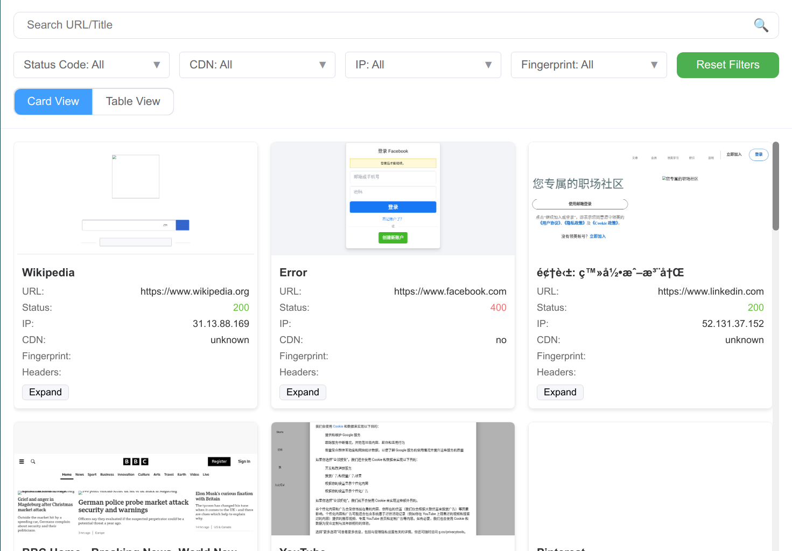
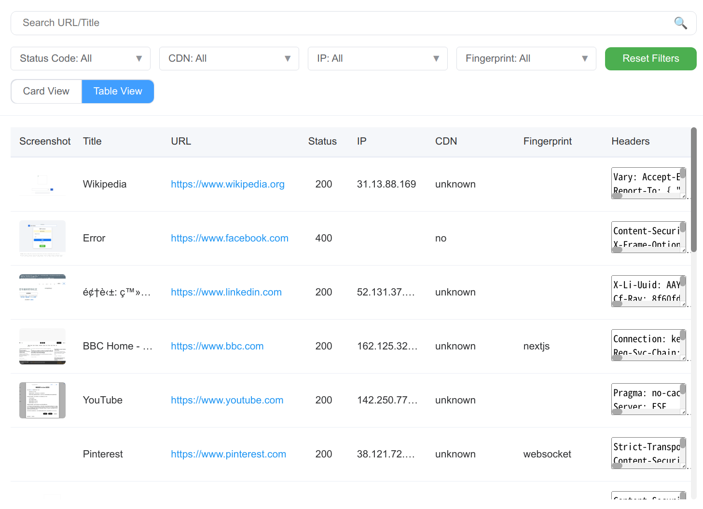

# WebLive

WebLive is a powerful tool designed for web reconnaissance and analysis. It allows users to perform various tasks such as sending HTTP requests, capturing screenshots, and gathering information about web servers. This project is built using Go and leverages concurrency to efficiently handle multiple requests simultaneously.

## Features

- **Concurrent HTTP Requests**: Utilize multiple threads to send requests to various URLs, improving efficiency and speed.
- **Screenshot Capture**: Capture screenshots of web pages using headless Chrome.
- **DNS Resolution**: Resolve domain names to IP addresses and gather CDN information.
- **Fingerprinting**: Identify web technologies and frameworks used by the target websites.
- **Output Formats**: Export results in HTML or CSV formats for easy analysis.

## Installation

To get started with WebLive, follow these steps:

1. Clone the repository:
   ```bash
   git clone https://github.com/aeverj/weblive.git
   cd weblive
   ```

2. Install the required dependencies:
   ```bash
   go mod tidy
   ```

3. Build the project:
   ```bash
   go build -o weblive cmd/start.go
   ```

4. Run the application:
   ```bash
   ./weblive -i input.txt -o html
   ```

## Usage

WebLive can be configured using command-line options. Here are some of the available options:

- `-th`: Number of threads (default: 30)
- `-i`: Input file path containing URLs
- `-o`: Output type (html or csv)
- `-timeout`: Request timeout in seconds (default: 10)

### Example Command
```bash
./weblive -i input.txt -o csv -th 10
```

## Screenshots




## Contributing

Contributions are welcome! If you have suggestions or improvements, feel free to open an issue or submit a pull request.

## License

This project is licensed under the MIT License. See the [LICENSE](LICENSE) file for more details.

## Acknowledgments

- [Chromedp](https://github.com/chromedp/chromedp) for headless browser automation.
- [SizedWaitGroup](https://github.com/remeh/sizedwaitgroup) for managing concurrent tasks.
